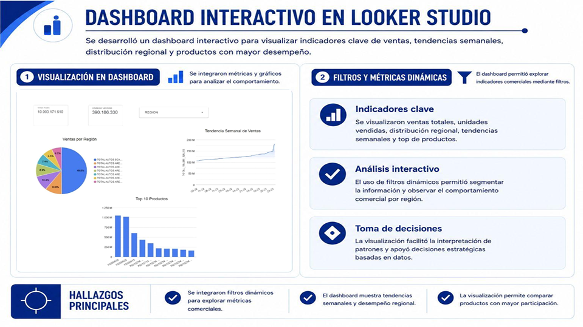
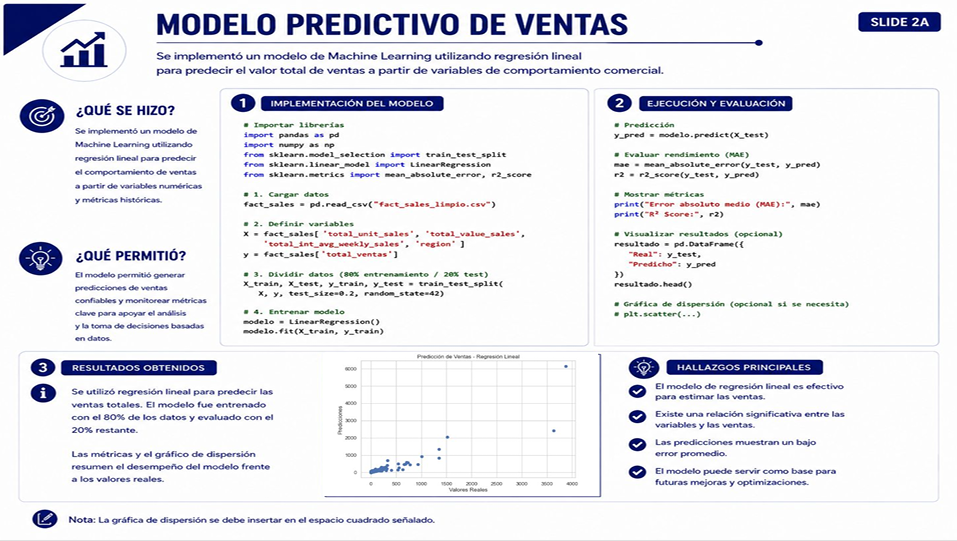
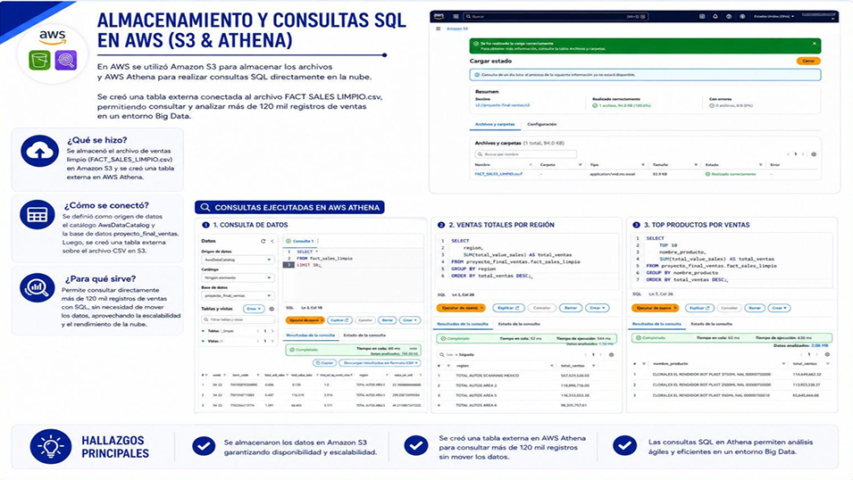

# 📈 Sales Forecasting & Commercial Analytics

---

## Overview

This project analyzes commercial sales data to identify trends, regional performance, product behavior, and future sales opportunities.

Using a complete analytics workflow that integrates Excel, SQL Server, Python, AWS, Looker Studio, and Machine Learning, raw sales data was transformed into actionable insights that support strategic business decision-making and sales forecasting.

---

## Business Problem

Organizations generate large volumes of sales data every day, but transforming that information into strategic decisions remains a challenge.

Understanding sales performance, identifying high-performing regions and products, and anticipating future demand are essential to improving commercial strategies and maximizing revenue.

### Business Question

How can historical sales data be leveraged to identify business opportunities, optimize commercial performance, and predict future sales trends?

---

## Project Objectives

- Analyze historical sales performance.
- Identify trends and sales patterns.
- Evaluate regional and product performance.
- Generate business KPIs.
- Develop interactive dashboards.
- Build predictive models for future sales estimation.
- Support data-driven decision-making.

---

## Data Source

### Dataset

Commercial sales dataset containing:

- Sales transactions
- Products
- Regions
- Weekly sales metrics
- Revenue information
- Commercial performance indicators

### Data Structure

- Fact sales table
- Dimensional business data
- Structured transactional records
- More than 120,000 sales records analyzed

---

## Tools & Technologies

- Excel
- SQL Server
- Python
- Pandas
- NumPy
- Scikit-Learn
- AWS S3
- AWS Athena
- Looker Studio
- Machine Learning
- Git & GitHub

---

## Methodology

### 1. Data Exploration in Excel

Initial exploration was performed using pivot tables, charts, and descriptive analysis to identify trends, regional differences, and top-performing products.

### 2. SQL Analytics

SQL Server was used to analyze:

- Sales by region
- Top-selling products
- Weekly sales evolution
- Regional performance metrics

Business queries helped identify commercial patterns and performance differences across regions.

### 3. Data Cleaning & Transformation

Python and Pandas were used to:

- Integrate data sources
- Validate data quality
- Remove duplicates
- Verify missing values
- Transform variables
- Generate derived metrics

A new metric (VALUE_PER_UNIT) was created to improve commercial analysis.

### 4. Exploratory Data Analysis (EDA)

EDA techniques were applied to:

- Analyze sales distributions
- Detect outliers
- Identify regional differences
- Evaluate product performance
- Study sales trends over time

### 5. Interactive Dashboard Development

A Looker Studio dashboard was created to visualize:

- Total sales
- Units sold
- Regional performance
- Weekly trends
- Top-selling products

Interactive filters enabled dynamic business analysis.

### 6. Predictive Modeling

A Linear Regression model was developed to forecast future sales performance using historical sales metrics.

The model was trained using 80% of the data and evaluated using the remaining 20%.

### 7. Cloud Analytics Implementation

Processed datasets were stored in Amazon S3 and queried using AWS Athena.

This architecture enabled scalable analytics over large datasets while supporting cloud-based reporting and business intelligence workflows.

---

## Key Findings

### Regional Performance Differences

Some regions consistently generated higher sales volumes, revealing important geographic opportunities.

### Revenue Concentration

A relatively small group of products generated a significant proportion of total revenue.

### Weekly Sales Patterns

Sales exhibited recurring weekly variations, highlighting demand fluctuations and seasonality.

### Data Quality Validation

Data cleaning and transformation processes ensured analytical consistency across more than 120,000 records.

### Predictive Capability

The regression model successfully identified relationships between business variables and future sales behavior.

---

## Dashboard & Visualizations

The following visualizations summarize the dashboard development, predictive modeling process, and cloud analytics implementation.

### Interactive Dashboard
<p align="center">  </p>

### Sales Forecasting Model
<p align="center">  </p>

### AWS S3 & Athena Analytics
<p align="center">  </p>

---

## Business Impact

The project supports:

- Better commercial decision-making.
- Identification of high-performing regions.
- Product portfolio optimization.
- Improved sales monitoring.
- Revenue growth opportunities.
- Scalable cloud-based analytics.
- Sales forecasting and planning.

---

## Project Limitations

- The predictive model uses Linear Regression and may be improved using more advanced Machine Learning techniques.
- External factors such as economic conditions and market dynamics were not incorporated.
- Forecasting performance depends on historical data quality.
- Real-time data ingestion was not implemented.

---

## Lessons Learned

Throughout this project, I strengthened my skills in:

- Commercial analytics.
- SQL-based business intelligence.
- Data cleaning and transformation using Python.
- Exploratory Data Analysis (EDA).
- Dashboard development in Looker Studio.
- AWS S3 and Athena analytics.
- Predictive modeling fundamentals.
- Translating analytical findings into business recommendations.

---

## Challenges

- Integrating multiple analytical tools into a single workflow.
- Managing large sales datasets.
- Ensuring data quality and consistency.
- Connecting cloud services with analytical processes.
- Developing business-focused visualizations and recommendations.

---

## Recommendations

- Strengthen strategies in top-performing regions.
- Continuously monitor top-selling products.
- Analyze weekly sales fluctuations in greater detail.
- Expand dashboard capabilities with real-time metrics.
- Implement advanced forecasting models.
- Automate ETL and cloud analytics processes.

---

## Conclusion

This project demonstrates how modern analytics technologies can be integrated into a complete commercial intelligence workflow. By combining Excel, SQL Server, Python, AWS, Looker Studio, and Machine Learning, raw sales data was transformed into strategic insights that support business growth, forecasting, and data-driven decision-making.

---

## Repository Structure

```text
sales-forecasting-commercial-analytics
├── README.md
├── notebooks
│   └── sales-forecasting-commercial-analytics.ipynb
├── report
│   └── sales-forecasting-commercial-analytics.pdf
└── Images
    ├── interactive-dashboard.png
    ├── sales-prediction-model.png
    └── aws-athena-analytics.png
```

---

## Author

*Ali Vega*
Cloud Computing / Data Analytics
